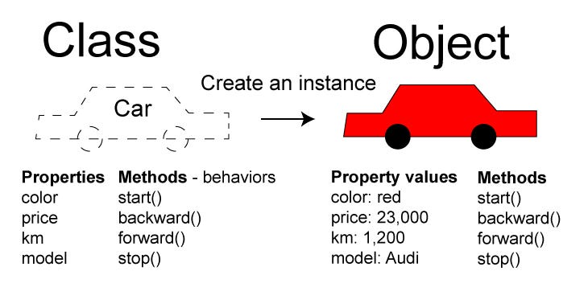

#### lesson-1

- this keyword
- Template function or constructor function

##### OOP 

1. Inheritance
2. Abstractions
3. Incapsulation
4. Polymorphism

- Classs (syntax sugar)
- property and method
- prototype
- getter 
- setter
- inheritance

https://sayhitosumit.medium.com/object-oriented-programming-oop-in-javascript-a264c4342d1c
